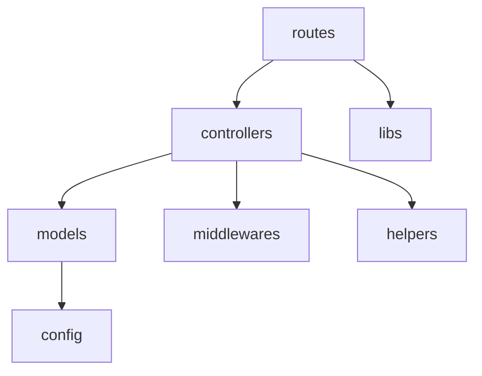

<p align="center"><a href="https://nodejs.org/es/about/" target="_blank"></a></p>


# Node JS
Este proyecto se llevó a cabo en NodeJS usando Express para realizar correctamente los webServices en base al modelo de MySQL.
Está estructurado dentro de diversos paquetes que poseen responsabilidades diversaspara disminuir la complejidad del código utilizando prácticas de desarrollo limpio respetando los principios SOLID modularizando de esta forma el resultado final.

# Estructura
- config: Este paquete posee los archivos de configuración de la base de datos y en un futuro otros patrones importantes.
- controllers: Acá se aplicarán directamente las funciones necesarias de los modelos, basicamente la lógica de negocio.
- helpers: Acá existirán funciones globales o variables globales que se utilizarán para reutilizarlas dentro de los controllers, un ejemplo puede ser tener una función para capitalizar datos de entrada.
- libs: Acá importaremos módulos y funciones de librerías externas que se utilicen para llevar a cabo funcionalidades, un ejemplo puede ser una librería de almacenamiento de imágenes.
- middlewares: Acá irán todas las protecciones de rutas que posteriormente serán consumidas por el frontend.
- models: Acá se definirán las estructuras de los datos que están almacenados en el gestor de MySQL.
- routes: Este paquete definirá las rutas con los métodos requeridos dependiendo de la función.



## Instalación
Antes de clonar directamente el proyecto desde la rama principal se necesita tener instalado:
- https://nodejs.org/es/
- https://www.mysql.com/products/workbench/
```sh
   git clone https://github.com/nachitoloquein/PetWalkBack.git
   cd petwalkback
   npm i
   npm run dev
```